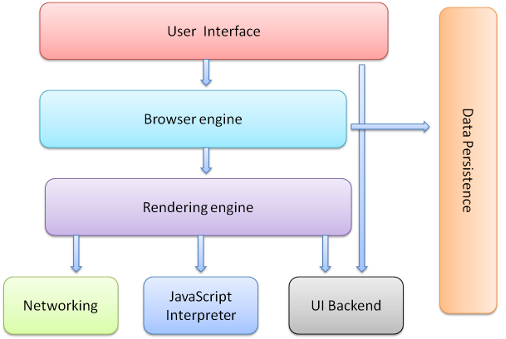

A browser is a software application used to locate, retrieve and display content on the World Wide Web, including Web pages, images, video and other files. As a client/server model, the browser is the client run on a computer that contacts the Web server and requests information. The Web server sends the information back to the Web browser which displays the results on the computer or other Internet-enabled device that supports a browser.

 # Components of web browser

## 1. User Interface:
The User Interface: The user interface is the space where User interacts with the browser. It includes the address bar, back and next buttons, home button, refresh and stop, bookmark option, etc. Every other part, except the window where requested web page is displayed, comes under it.

## 2.The Browser Engine: 
The browser engine works as a bridge between the User interface and the rendering engine. According to the inputs from various user interfaces, it queries and manipulates the rendering engine.

## 3.The Rendering Engine:
 The rendering engine, as the name suggests is responsible for rendering the requested web page on the browser screen. The rendering engine interprets the HTML, XML documents and images that are formatted using CSS and generates the layout that is displayed in the User Interface. However, using plugins or extensions, it can display other types data also. Different browsers user different rendering engines:
* Internet Explorer: Trident
* Firefox & other Mozilla browsers: Gecko
* Chrome & Opera 15+: Blink
* Chrome (iPhone) & Safari: Webkit

## 4.Networking:
 Component of the browser which retrieves the URLs using the common internet protocols of HTTP or FTP. The networking component handles all aspects of Internet communication and security. The network component may implement a cache of retrieved documents in order to reduce network traffic.

## 5.JavaScript Interpreter: 
It is the component of the browser which interprets and executes the javascript code embedded in a website. The interpreted results are sent to the rendering engine for display. If the script is external then first the resource is fetched from the network. Parser keeps on hold until the script is executed.

## 6.UI Backend: 
UI backend is used for drawing basic widgets like combo boxes and windows. This backend exposes a generic interface that is not platform specific. It underneath uses operating system user interface methods.

## 7.Data Persistence/Storage: 
This is a persistence layer. Browsers support storage mechanisms such as localStorage, IndexedDB, WebSQL and FileSystem. It is a small database created on the local drive of the computer where the browser is installed. It manages user data such as cache, cookies, bookmarks and preferences.

## Rendering engine
In order to render content the browser has to go through a series of steps:
1. Document Object Model(DOM)
2. CSS object model(CSSOM)
3. Render Tree
4. Layout
5. Paint.

### 1.Document Object Model
To process a html file and get to the document object model event(DOM) the browser has to go through 4 steps:

1. Convert bytes to characters
2. Identify tokens
3. Convert tokens to nodes
4. Build DOM Tree

This entire process can take some time, specially if there is a large amount of HTML to process. This means that the initial file size of your DOM tree will have a performance cost.

browser initially sends a request for the html, then it starts receiving the response in chunks of data, and initializes the html parser, as the parser finds any links for CSS or Javascript, it immediatelly sends a request for them, after that it also sends requests for all the other assets found in the rest of the page.

When this process is finished the browser will have the full content of the page, but to be able to render the browser has to wait for the CSS Object Model, also known as CSSOM event, which will tell the browser how the elements should look like when rendered.

### 2. CSS Object Model
Just as with HTML, the CSS rules need to be converted into something that the browser understands, so these rules go through the same steps as the document object model.

In this stage the CSS parser goes through each node and gets the styles attributed to it.

CSS is one of the most important elements of the critical rendering path, because the browser blocks page rendering until it receives and processes all the css files in your page, CSS is render blocking

### 3. The Render Tree
This stage is where the browser combines the DOM and CSSOM, this process outputs a final render tree, which contains both the content and the style information of all the visible content on the screen.

### 4. Layout
This stage is where the browser calculates the size and position of each visible element on the page, every time an update to the render tree is made, or the size of the viewport changes, the browser has to run layout again.

### 5. Paint
When we get to the paint stage, the browser has to pick up the layout result, and paint the pixels to the screen, beware in this stage that not all styles have the same paint times, also combinations of styles can have a greater paint time than the sum of their parts. For an instance mixing a border-radius with a box-shadow, can triple the paint time of an element instead of using just one of the latter.

